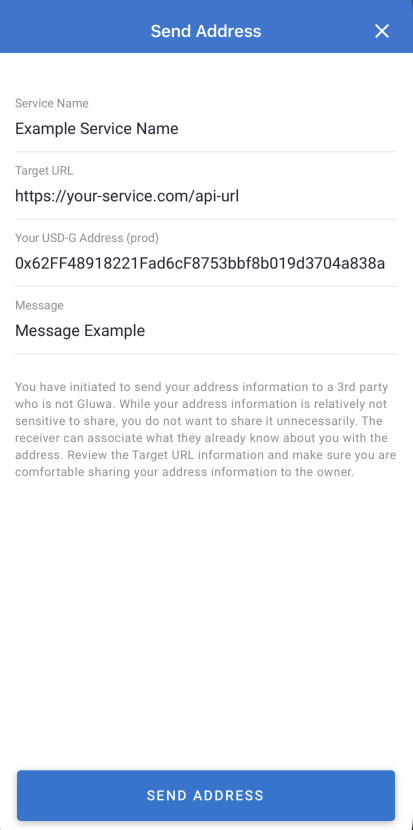

# Sending Address

## Update

Add support universal link (03/03/2021)

## About Send Address

In this section, you will learn how to get Gluwacoin address or Bitcoin address from a user to your server.\
There are two ways to send address. If possible, it is recommended to use both methods in parallel.

**The Steps of Send Address (using QR code)**

1. Create a QR code meeting the send address standard.
2. A user scans the QR Code with the camera inside Gluwa mobile app.
3. The app sends the address as a web request to the API URL defined within the QR code.
4. The API may make a respond and tell the user the address was successfully received.

**The Steps of Send Address (using universal link)**

1. Create a universal link url meeting the send address standard.
2. Users click this link on their mobile device to open the Gluwa app.
3. If the user has not installed the app, the user is landed on a page that recommends installing the Gluwa app.

### Send address data parameters

| Key         | Required | Description                                                                                                                                                                           |
| ----------- | :------: | ------------------------------------------------------------------------------------------------------------------------------------------------------------------------------------- |
| QrType      |  `true`  | This value must be `SendAddress` .                                                                                                                                                    |
| Key         |  `true`  | A key to identify the user. You can set any value that fits your requirements.                                                                                                        |
| Message     |  `false` | A message shown in the send address preview screen. If there is any information the user must know, you can put it in this field.                                                     |
| ServiceName |  `true`  | The service name shown in the send address preview screen.                                                                                                                            |
| TargetUrl   |  `true`  | The API URL where you will receive the address. Shown in the send address preview screen.                                                                                             |
| Currency    |  `true`  | Set the currency of the address you want to receive. See [#currency-symbols](../api/currency-and-conversion-symbols.md#currency-symbols "mention") for a list of available currencies |
| Environment |  `true`  | Set the environment of the address you want to receive. `prod` `sandbox`                                                                                                              |

### Creating a QR Code for Send Address (using QR code)

In this section, we describe what information you need to include in the QR Code to receive address information from the user.

#### QR Code Example


Generate a QR code using send address data parameters. There are QR code generator libraries published on the web. e.g [https://github.com/cozmo/jsQR](https://github.com/cozmo/jsQR)

```javascript
// example code when using cozmo/jsQR
import jsQR from "jsqr";

const width = 300;
const height = 300;
const sendAddressData = {
    QrType: 'SendAddress',
    Key: 'Your user\'s unique key',
    Message: 'The message to be exposed to the user',
    ServiceName: 'Your service\'s name',
    TargetUrl: 'Your service\'s api url',
    Currency: 'sUSDCG',
    Environment: 'prod',
};

const code = jsQR(sendAddressData, width, height);
```

### Scanning the Send Address QR Code

#### Universal link Example

```markup
<a href="https://app.gluwa.com/action/scan/%7B%22currency%22%3A%22BTC%22%2C%22Target%22%3A%22TEST%22%7D">
    Connect to Gluwa app
</a>
```

The universal link url can be created as follows.

```javascript
const sendAddressData = {
    QrType: 'SendAddress',
    Key: 'Your user\'s unique key',
    Message: 'The message to be exposed to the user',
    ServiceName: 'Your service\'s name',
    TargetUrl: 'Your service\'s api url',
    Currency: 'sUSDCG',
    Environment: 'prod',
};

const url = `https://app.gluwa.com/action/scan/${encodeURIComponent(JSON.stingify(sendAddressData))}`;
```

### After open Gluwa app

Once the user scans the send address QR code or click universal link, the user will get redirected to a send address preview screen. There, the user can either confirm to send his address by pressing `SEND ADDRESS` button on the bottom or cancel the process by pressing the cancel icon on the upper right corner.



### Sending the Address

Once the user confirms the information on the send address preview screen and press the `SEND ADDRESS` button, the mobile app makes a `POST` http request with the address information. The app encodes `Key` value and `Address` as JSON and include it in the request body. The request is sent to the target URL as defined in the `TargetUrl`.

#### `POST` Request

```
{
    "Key": "as defined in the Send Address QR Code",
    "Address": "Address of the user"
}
```

### Response

After receiving the Address information, you can send the result as a response message to the user.

| Key     | Required | Description |
| ------- | :------: | ----------: |
| Code    |  `true`  | `200` `201` |
| Message |  `false` |    `String` |
