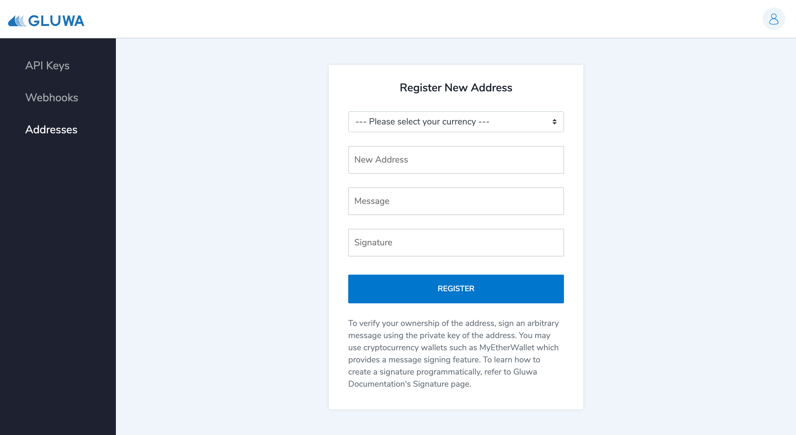
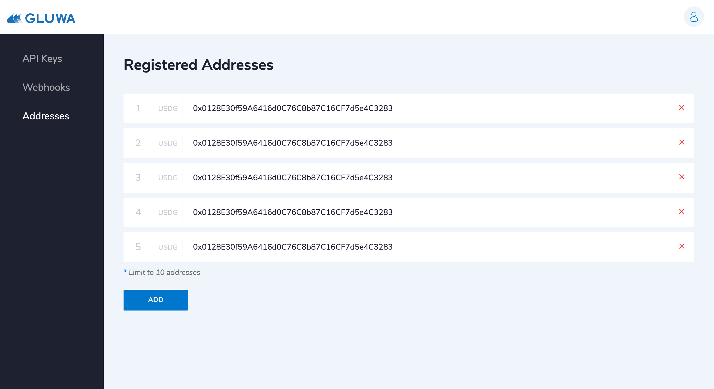

# Addresses

This guide assumes that you've setup your webhook endpoints already. If you haven't, follow the Webhook guide below first.


[webhooks.md](webhooks.md)


## Register Your Wallet Address

Gluwa will listen to any event that occurs to registered addresses and send webhook notifications to the registered webhook URLs. Open [Gluwa Dashboard Registered Addresses](https://dashboard.gluwa.com/addresses) page to register your addresses.

Note that the form requires you to sign an arbitrary message with the private key of the address. The signature will prove your ownership of the address.

You can create the signature on Gluwa mobile application, or using any other third party apps like below:

1. MyEtherWallet (Ethereum)
2. MetaMask (Ethereum)
3. Electrum (Bitcoin)


The above list of third party apps is not a comprehensive list. There are many other apps that provide message signing functionality, so you can use any of them.



[create-a-signature.md](../gluwa/create-a-signature.md)


Once you register your address, Gluwa will send a webhook to your registered webhook URL each time any of the supported events occur on your address. You can find the supported events [here](webhooks.md#supported-events).
