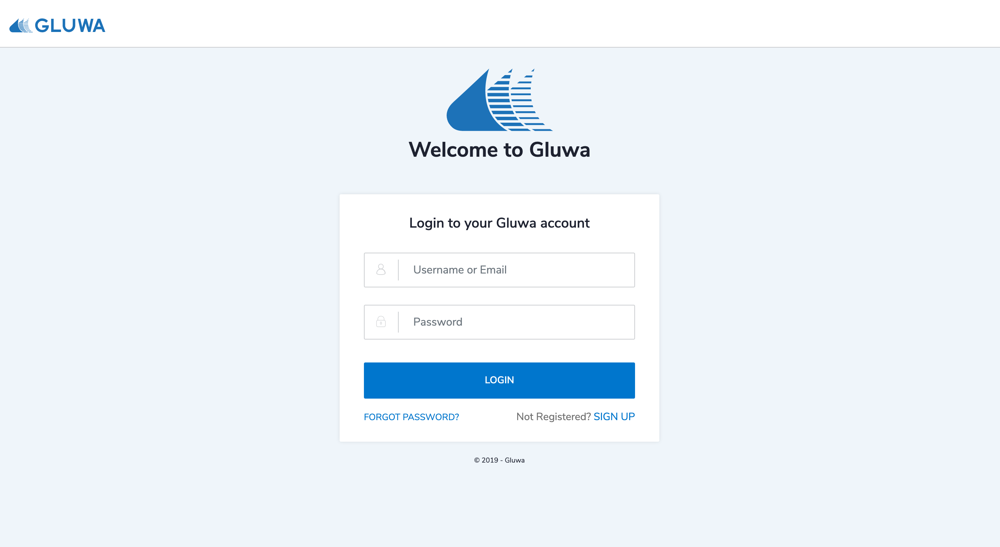

# API Keys

## **Get Your API Key and Secret**

### Login to [Gluwa dashboard](http://dashboard.gluwa.com)

1. Visit the dashboard at [https://dashboard.gluwa.com](https://dashboard.gluwa.com).
2. If you are not logged in already, you will get redirected to a login page.
3. Sign up to Gluwa if you do not have a Gluwa account yet.

### Open the [API Keys page](http://dashboard.gluwa.com/APIKey)

1. Visit the API Keys page at [https://dashboard.gluwa.com/apikey](https://dashboard.gluwa.com/ApiKey).
2. You will see an auto-generated API Key and secret of your account on the page.
3. Your API secret is covered in grey boxes by default for your security. Click on the eye shaped icon to reveal your API secret.


Anyone with your secret API key can make any API call on behalf of your account, such as creating a payment request. You should limit access to your API keys as much as possible. Do not store them in a shared repository such as your version control system.



**Use only your sandbox API keys for testing and development**. This ensures that you don't accidentally modify your live customers or charges. Refer to [Environments](../../development/environments.md#sandbox-environment-urls) to learn how to use the sandbox mode.


