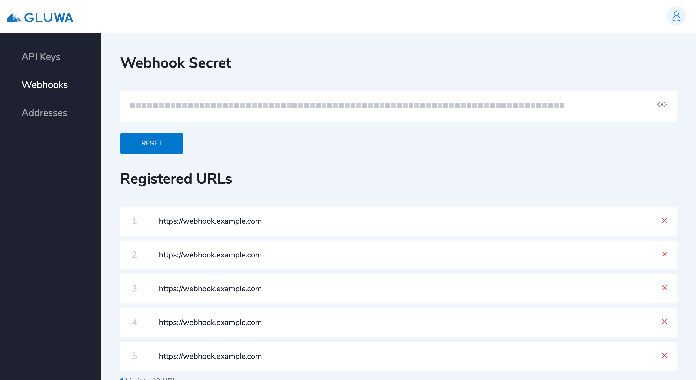

# Webhooks

You can receive a webhook notification from Gluwa whenever a transaction associated with your registered Gluwacoin wallet is confirmed on the blockchain.

## Get Webhook Secret

1. Visit the Webhook Management page at [https://dashboard.gluwa.com/webhook](https://dashboard.gluwa.com/webhook).
2. You will see an auto-generated Webhook Secret of your account on the page.
3. Your Webhook Secret is covered in grey boxes by default for your security. Click on the eye-shaped icon to reveal your Webhook Secret.

## Register Webhook Endpoint

1. Visit the Webhook Management page at [https://dashboard.gluwa.com/webhook](https://dashboard.gluwa.com/webhook).
2. Register your webhook endpoints on the webhook management page.
3. Gluwa sends a webhook to the registered URLs.


**Use only your sandbox webhook secret for testing and development**. This ensures that you don't accidentally modify your live customers or charges. Refer to [Environments](../../development/environments.md#sandbox-environment-urls) to learn how to use the sandbox mode.


