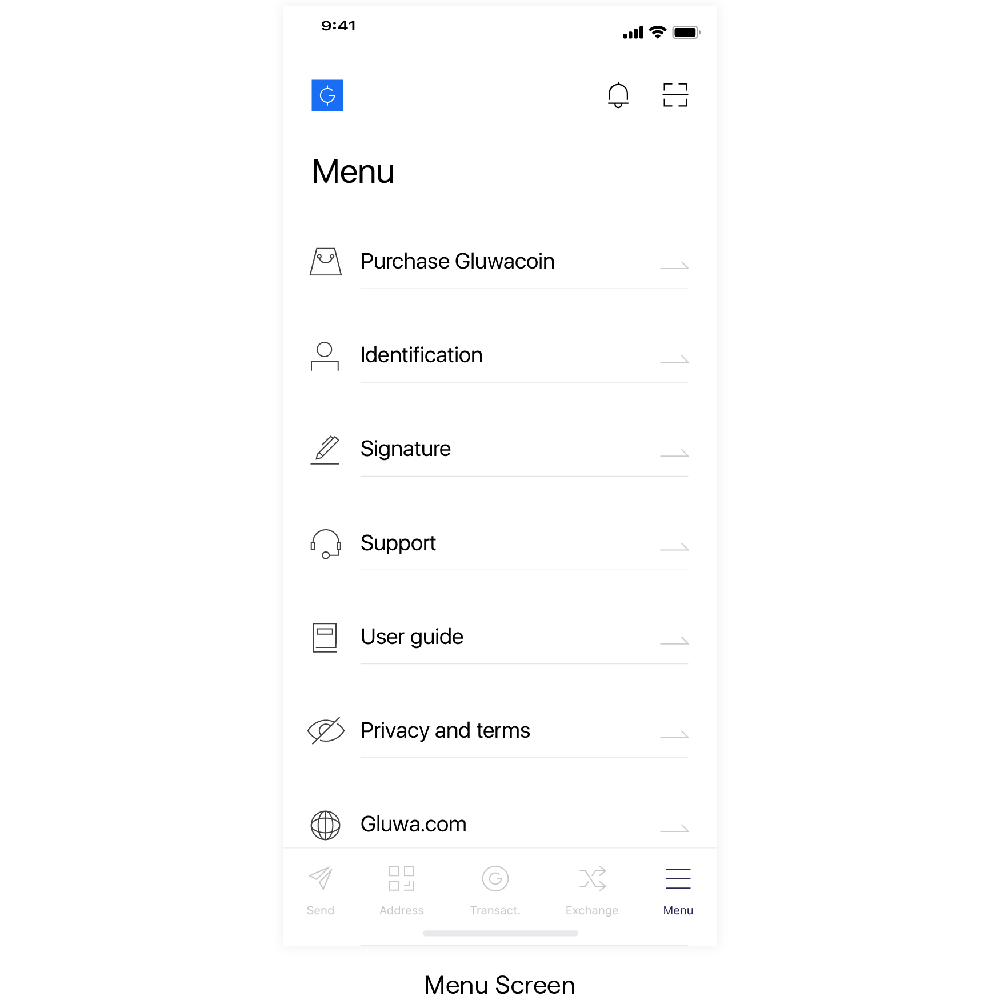
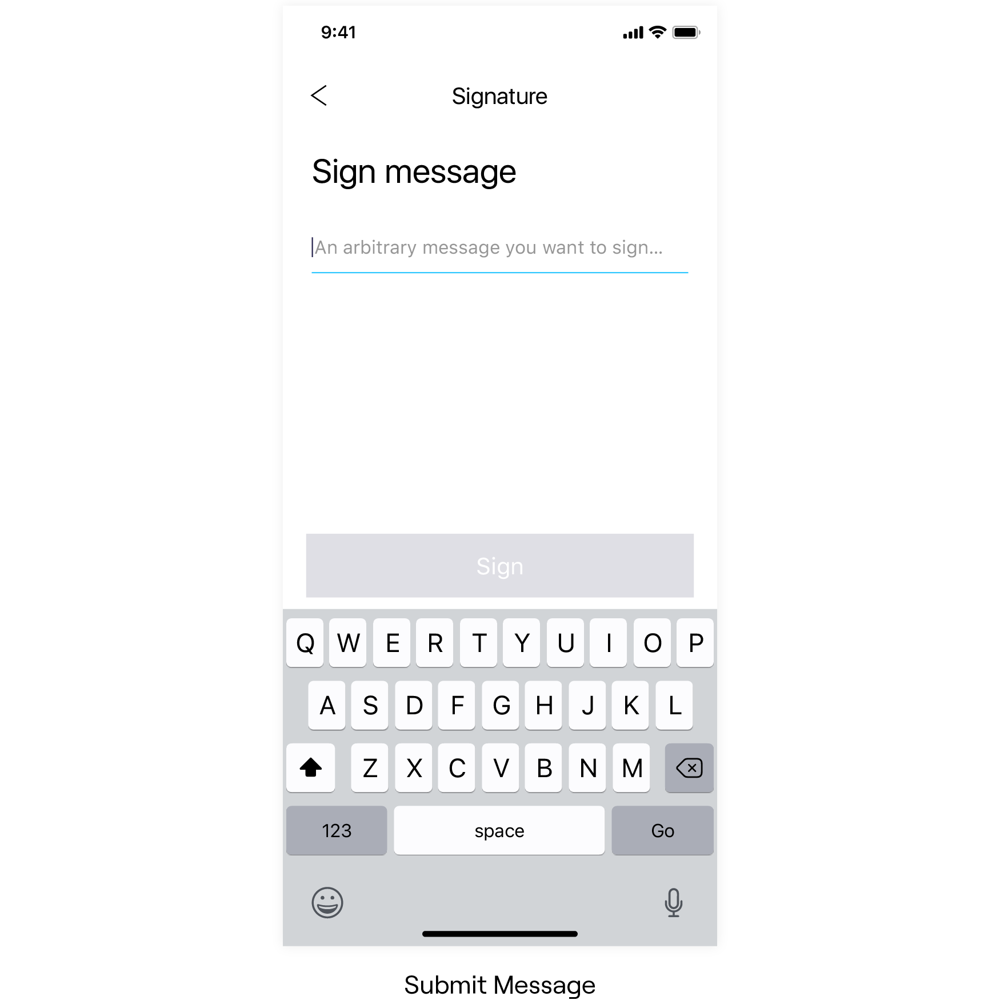
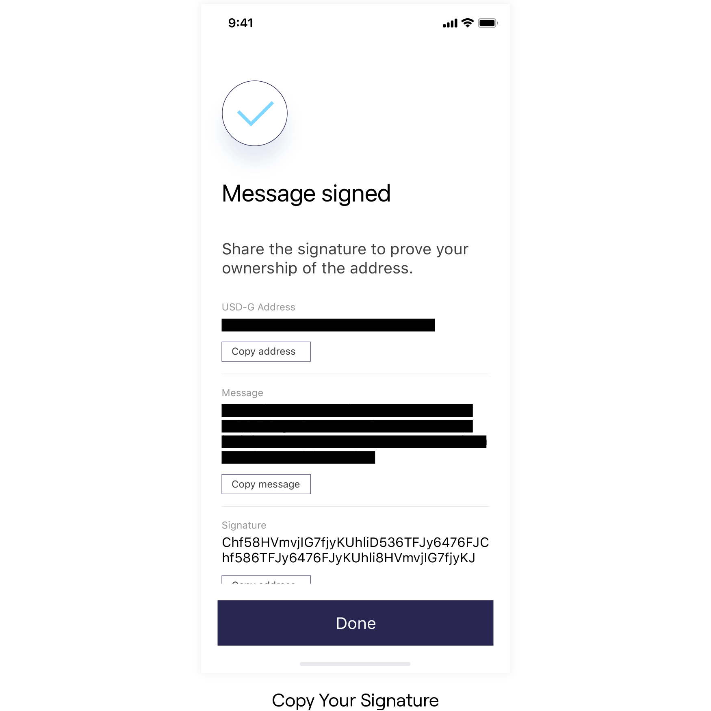

# Create a Signature

Just like signing a contract with a pen to authorize it, you can create a digital signature using the secret key of your wallet. A 3rd party can cryptographically verify that the signature was created by your secret key. Thus, the signature can be used approve a certain message.

## Signing a Message

Gluwa mobile app provides a simple interface for signing a message.

First, enter the menu screen from the bottom navigation tab. Find the Signature menu on the menu list and select it.

You will see the Sign screen.

Now, Gluwa app will display your address, message and signature.

