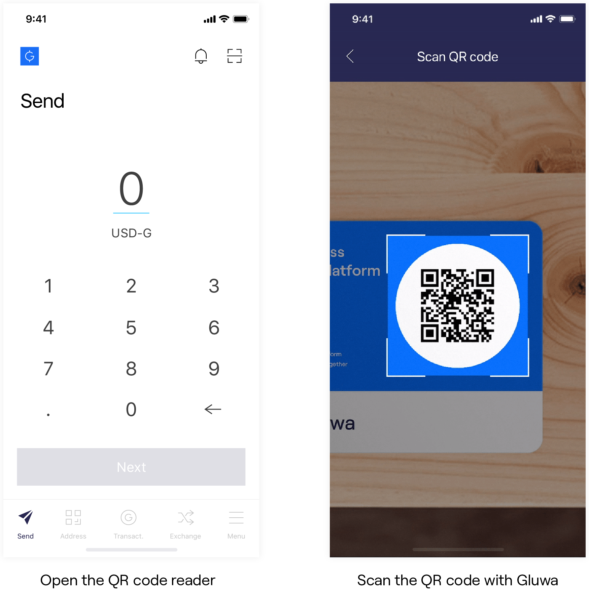
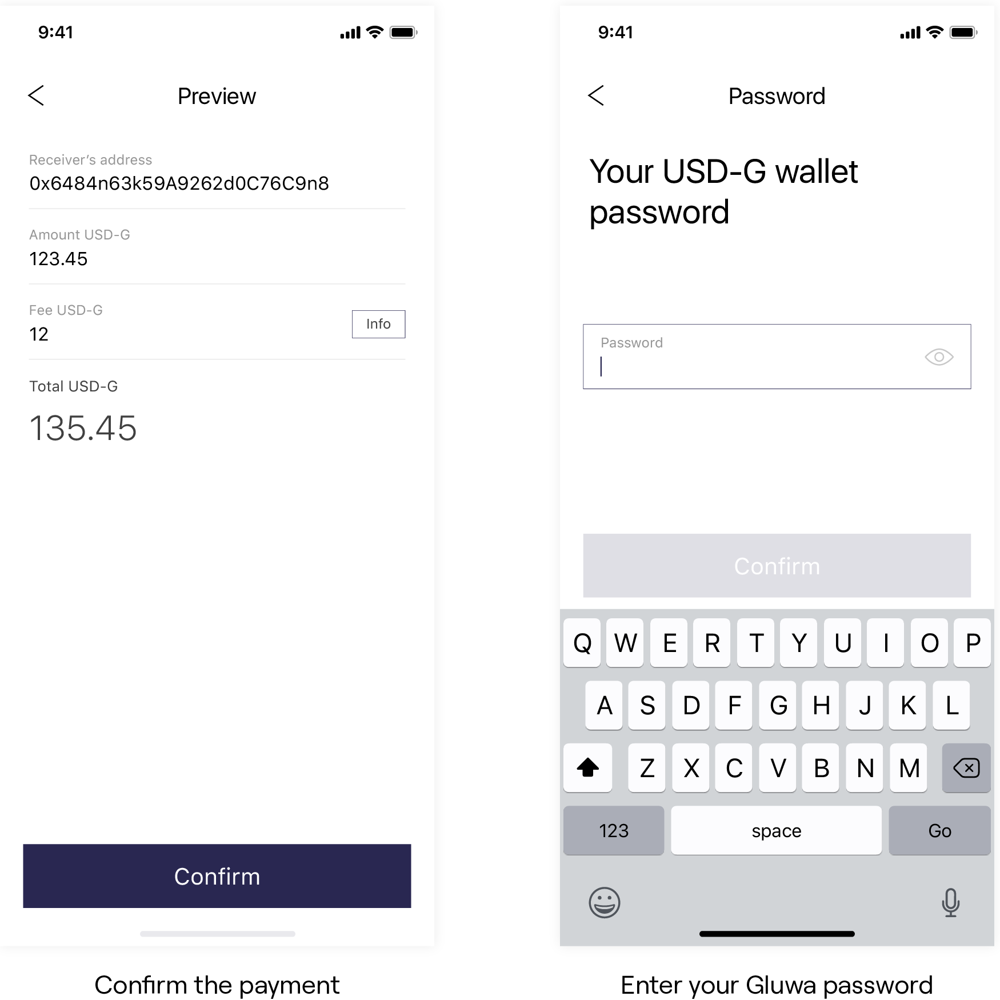
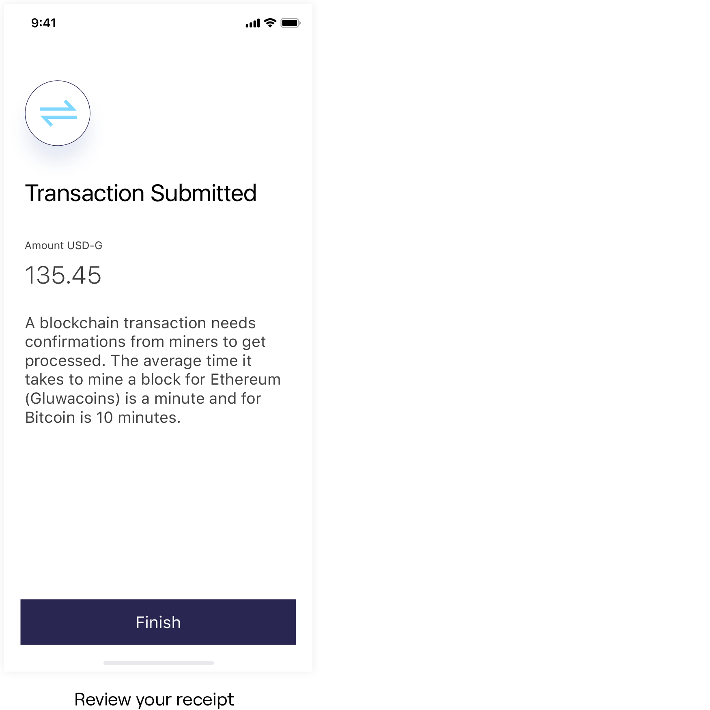

# Make QR Code Payments

## Scanning a QR Code

You can make payments to merchants via scanning their Gluwa QR Code. Open your Gluwa mobile app and scan the QR code to initiate a payment.

## Making a Payment

Once you scan the QR code, Gluwa will show you a preview of the payment. Review and confirm the payment by submitting your Gluwa password.

## Payment Receipt

You will receive a receipt for your payment as soon as you submit your password. The merchant will get notified of your payment automatically. Since the payment was made on a blockchain, some merchants may choose to wait until your payment get confirmed by the blockchain. The confirmation time usually takes about a minute for Gluwacoins and ten minutes for Bitcoin.

