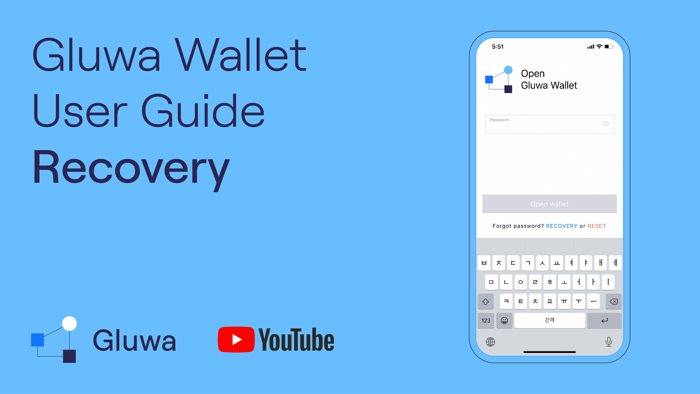
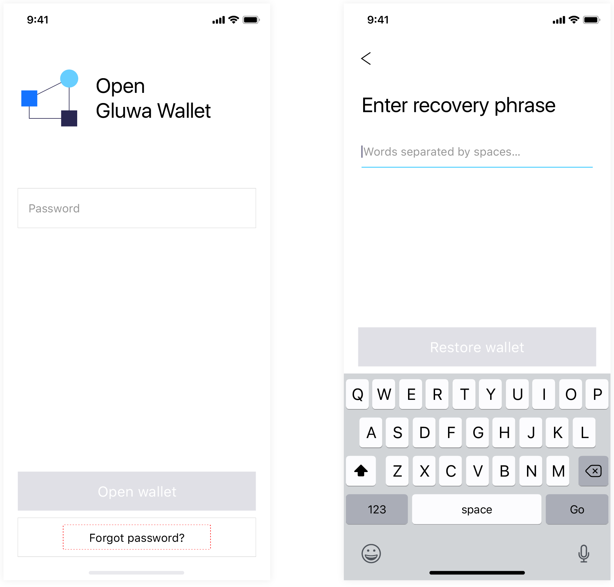
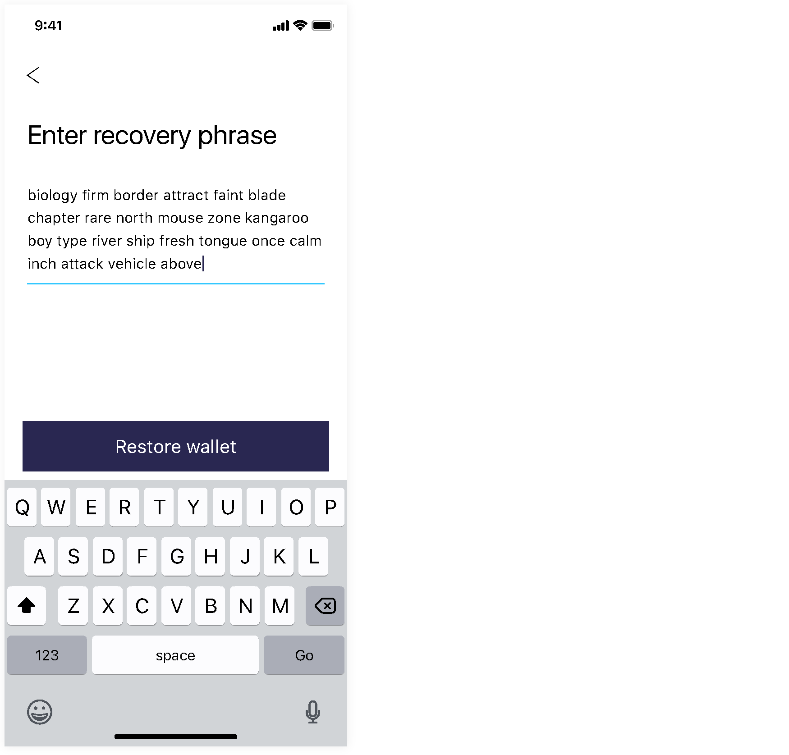

# Restore Wallet

When you created a new Gluwa Wallet, you were prompted to note down the generated [Recovery Passphrase.](https://docs.gluwa.com/get-started/gluwa/create-a-new-gluwa-wallet#backup-the-recovery-phrase) In case you forgot your password, you can recover by entering all the Recovery Passphrase words.

1. On the Gluwa login screen, click on **Recover**
2. In the following screen, press on **Recover Wallet**
3. On the 'Enter Recovery Phrase' screen:
   1. Provide a new password
   2. Enter the recovery Phrase

