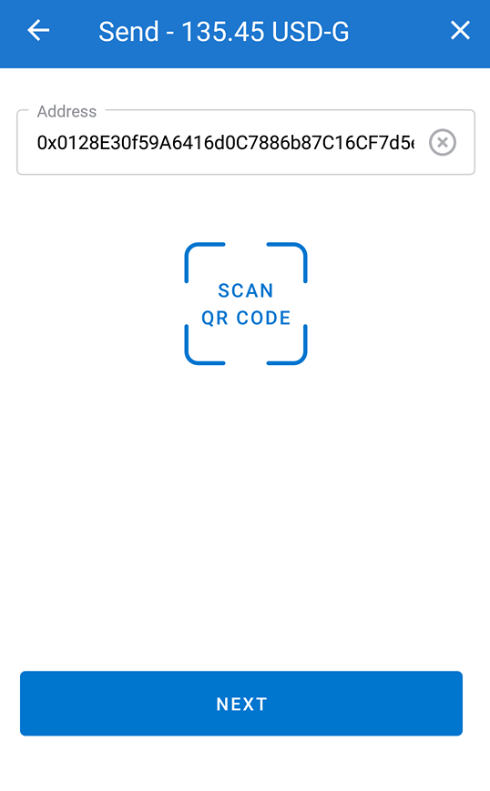

# Send Gluwacoin to an address

## Watch Explainer Video

To send Gluwacoin to an address manually, you will need the receiver's ETH public address, which always starts `0x`.

1. From the **Send** section, type in the amount you want to transfer and press on **Next**
2. Paste or type in your receiver's ETH public address and press on **Next**
3. The Preview window will display the transaction details before completing the transfer
4. Re-enter your Gluwa password


There is a transfer fee applied when you initiate a send transaction to another user.[ Read more about it here.](https://help.gluwa.com/hc/en-us/articles/360009770054?fbclid=IwAR3Qx62ZWa3-8A7mGxwKb7AvuURbJtoIAIEQ7xxM4cdqSsT5BYnLSdjaC-4)


You will see a confirmation screen once the transfer has been completed.

